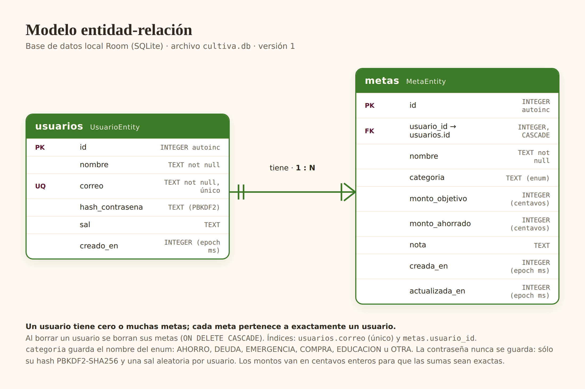

# Cultiva Mobile

Aplicación Android nativa de **Cultiva**, la app de educación financiera de Riverstar.
Esta versión móvil es un subconjunto del prototipo: cuentas locales y **metas de ahorro**,
con búsqueda y filtros.

**Stack:** Kotlin · Jetpack Compose (Material 3) · Room (SQLite) · ViewModel + StateFlow ·
Navigation Compose · DataStore · JUnit.

## Cómo cumple los requisitos técnicos

| Requisito | Dónde está |
|---|---|
| **A. Login** conectado a Room | `ui/auth/LoginScreen.kt`, `data/repo/AuthRepository.kt`, `data/db/UsuarioDao.kt` |
| Validación segura | La contraseña **no se guarda**: sólo un hash PBKDF2-SHA256 con sal aleatoria (`dominio/Contrasena.kt`). La comparación es en tiempo constante. El mensaje de error no revela si el correo existe. |
| Registro de cuenta | `ui/auth/RegistroScreen.kt` (nombre, correo único, contraseña ≥ 8 con letras y número, confirmación) |
| Sesión básica | `data/sesion/SesionRepository.kt` (DataStore). Si hay sesión, la app abre directo en *Mis metas*. |
| «Atrás» no vuelve al Login | `ui/navegacion/CultivaNavHost.kt`: al entrar se hace `popUpTo(graph) { inclusive = true }`, que saca Login y Registro de la pila. Al cerrar sesión se vacía la pila otra vez. |
| **B. Create** con validación | `ui/metas/MetaFormScreen.kt` + `MetaFormViewModel.kt`. No guarda si falta el nombre, la categoría o el monto objetivo, ni si un monto no es válido (`dominio/Validacion.kt`). |
| **Read** con `LazyColumn` | `ui/metas/MetasScreen.kt`: tarjetas con categoría, nombre, barra de avance y montos |
| **Update** | La misma pantalla de formulario, precargada con la meta (`metas/{id}`) |
| **Delete** con confirmación | Botón de basura en cada tarjeta y en la pantalla de edición → `AlertDialog` «¿Borrar esta meta? No se puede deshacer.» |
| **C. Buscador en tiempo real** | `MetasViewModel`: el `TextField` actualiza un `MutableStateFlow`; `debounce(250)` + `flatMapLatest` sobre un `Flow` de Room. La consulta corre fuera del hilo principal, así que la interfaz no se congela. |
| **Extra:** filtro por categorías | Fila de `FilterChip` (Todas, Ahorro, Salir de una deuda, Fondo de emergencia, …) combinada con la búsqueda |

## Modelo entidad-relación



La fuente de la imagen está en `docs/modelo-er.html`. Al compilar, Room además exporta el
esquema real a `app/schemas/`.

## Estructura

```
app/src/main/java/mx/riverstar/cultiva/mobile/
├─ CultivaApp.kt            contenedor de dependencias (base, sesión, repositorios)
├─ MainActivity.kt
├─ data/
│  ├─ db/                   Room: entidades, DAOs y CultivaDatabase
│  ├─ repo/                 AuthRepository, MetaRepository
│  └─ sesion/               SesionRepository (DataStore)
├─ dominio/                 reglas puras: Validacion, Contrasena, Dinero, Categoria
└─ ui/
   ├─ auth/                 Login y Registro (pantalla + ViewModel)
   ├─ metas/                lista, búsqueda, filtros y formulario (pantalla + ViewModel)
   ├─ navegacion/           NavHost y manejo de la pila
   └─ theme/                colores y tipografía de Cultiva (claro y oscuro «Jade»)
```

Los montos se guardan en **centavos enteros** (`Long`), no en coma flotante, para que las sumas
sean exactas.

## Cómo correrla

1. Abrir la carpeta en **Android Studio** (Koala o más nuevo, JDK 17).
2. Esperar la sincronización de Gradle.
3. Ejecutar la configuración `app` en un emulador o teléfono con Android 8.0 (API 26) o superior.

Desde la terminal:

```bash
./gradlew testDebugUnitTest   # pruebas unitarias
./gradlew assembleDebug       # APK en app/build/outputs/apk/debug/
```

La primera vez no hay cuentas: toca «¿No tienes cuenta? Crea una».

## Pruebas

`app/src/test/` tiene pruebas JUnit de la validación de formularios, del hash de contraseñas,
de la conversión de montos y del escape de la búsqueda. GitHub Actions
(`.github/workflows/android.yml`) corre las pruebas y compila el APK en cada push; el APK
queda como artefacto del run.

## Equipo

<!-- Completar con los integrantes del equipo y lo que aportó cada uno. -->
| Integrante | Aportación |
|---|---|
| | |

Cada integrante debe subir sus propios commits con su cuenta.
